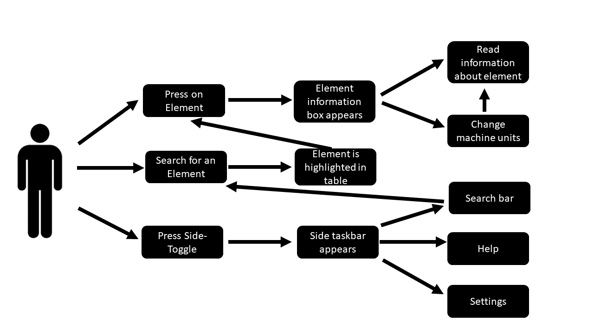

## Stakeholders

#### Mike Matthews
The periodic table app was requested

#### Dr Stuart Kearns
The periodic-table app was re

#### Ben

#### EMAS members
micro-analysis organization which will be the majority of our user base  The organization that our client is part of. App will be most helpful for them

#### Research students -
 students doing research in microbeam related field Students part of the

#### Lab staff -
 technicians in charge of equipment etc (commercial use as well as academic)

#### General Public
  app is gonna be available on the store

