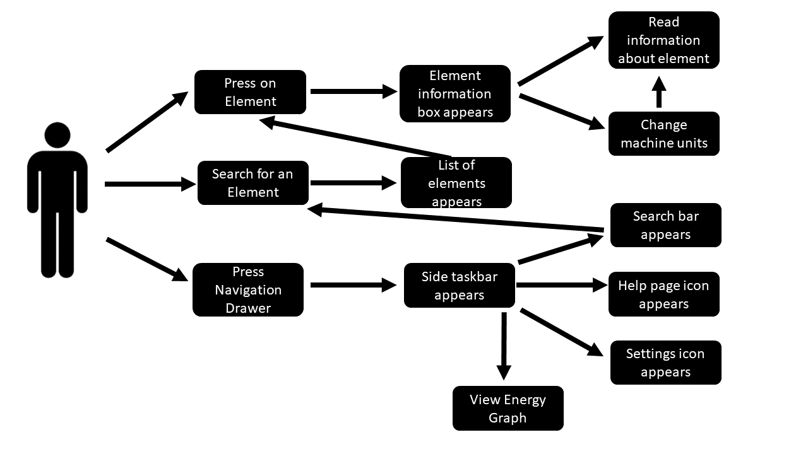

## Stakeholders

#### Mike Matthews
The periodic table application was requested by Mr Matthews and laid out the basis of the specification. Mr Matthews is a user with hope the app will benefit and ease his work.

#### Dr Stuart Kearns
Lecturer and researcher at the University of Bristol working closely with Mr Matthews.

#### Dr Benjamin Buse
Researcher at the University of Bristol working alongside both Mr Matthews and Dr Kearns.

#### EMAS
The European microbeam analysis society is an organization that will provide the majority of our user base. The application will facilitate members of the society. Our client is part of this organization.

#### Research students
 Students doing research in microbeam-analysis related fields. Students part of Bristol University as well as other institutions.

#### Lab staff
Technicians in charge of equipment in microbeam analysis laboratories in different institutions academic or commercial.

#### General Public
The app will be available on the app-store hence anyone could make use of it.

### High User Case Diagram

