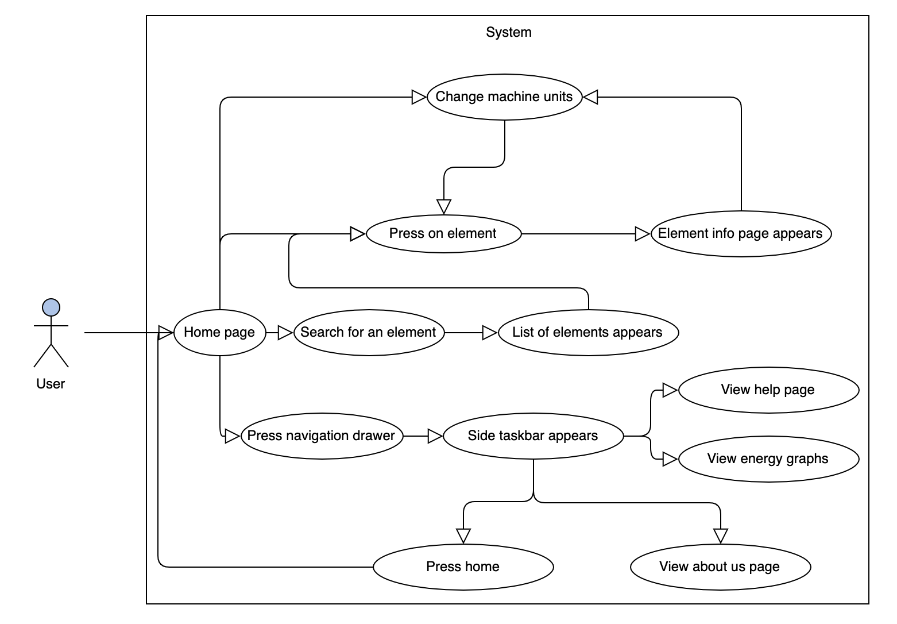

# **Requirements**

## Stakeholders

#### Mike Matthews
The periodic table application was requested by Mr Matthews. He provided the initial specification and functionality of the app. His vision for the app was for it to be a means of providing essential microbeam-analysis information in an efficient way.

#### Dr Stuart Kearns
Lecturer and researcher at the University of Bristol working closely with Mr Matthews.

#### Dr Benjamin Buse
Researcher at the University of Bristol working alongside both Mr Matthews and Dr Kearns.

#### EMAS
The European Microbeam Analysis Society is an organisation that will consist of the majority of our user base. The application will facilitate members of the society. Our client is part of this organisation.

#### Research students
Students doing research in microbeam-analysis related fields. Students part of Bristol University as well as other institutions.

#### Lab staff
Technicians in charge of equipment in microbeam analysis laboratories in different institutions, academic or commercial.

#### General Public
The app will be available on the Google play-store therefore anyone could make use of it.

## High User Case Diagram
Our users will interact with the application in very similar ways due to the nature of the system. Therefore  all interactions can be encompassed by the following diagram:

Due to the application being offline, interaction with non-human actors is  not possible.

## Functional requirements:
* View information on each element
    * Must display the periodic table
    * Must show information of elements when button is clicked
    * Must be able to change units by pressing a button or using a toggle
    * User must be able to read the information displayed
* Search for an element
    * Must be able to search for elements by symbol or name
    * Must autocomplete the name of element
    * Must show a list of the elements and should reduce the items shown as element is being typed
* View the energy graph
    * Must display the basic image of the energy chart
* User must not be able to see or make changes to code

## Non-Functional requirements:e
* Be able to find an element on the periodic table display in under 10 seconds
* Make sure text is readable half a meter away from face when user has 20/20 vision
* User should be able to find and use the changing unit/instrument feature in under 5 seconds
* After reading the help page of the app, user should be able to use all features of the app confidently and quickly
* User should take no longer than 15 seconds to find the information they're looking for
* If user clicked wrong element, they must be able to find the desired element in less than 5 seconds

## The core set of the use-case goals:
1. View information on each element
1. Search for an element
1. Use the navigation drawer
1. Switch between instruments
1. View the energy graphs

##  Flow Breakdown
#### _Basic flow_:
1. View information on each element
    - Periodic table will be displayed, fitted to the screen
    - User clicks on desired element
    - The click creates and sends an SQL query
    - Data is retrieved from the database
    - Data is displayed in a suitable format on element page

2. Search for an element with the symbol or name.  
    - User clicks on the search icon  
    - List appears with all the elements in order of increasing atomic number  
    - User types into the bar the element symbol or name  
    - The word is autocompleted  
    - The drop down list shows only the relevant element  
    - Clicking the list item opens up the information page for that element

3. Use the navigation drawer to perform the following activities:
    * Switch between instruments  (this step also involves changing the units based on the instrument being used)
        - Option 1:
            * Open filter drawer
            * Use the menu to switch between instruments
            * Elements in the instrument' range are highlighted
        - Option 2:
            * Click the element from the table or using the search bar
            * Element page appears
            * Use the filter icon on the element page to switch between instruments
    * View the energy graph
        * Open Menu drawer
        * Click on the energy graph tab
        * Graph is displayed
    * View the Help page
        * Open navigation drawer by swiping or clicking the icon
        * Click on the Help tab
        * Help page is displayed
    * View the Settings page
        * Open navigation drawer by swiping or clicking the icon
        * Click on the Settings tab
        * Settings page is displayed
        * Use the filter to change default instruments

#### _Alternative flow_ :
* User may utilise the search bar to look for an element rather than clicking on the periodic table display
* User may switch between instruments first then look for an element (this can be done using the filter in the toolbar rather than on the individual element pages)
* User may change the default settings from one instrument to another before looking at an individual element data

#### _Exceptional flow_ :
* User is not aware on how to proceed with any feature on the app
    * User can open navigation drawer and use the Help tab to understand the layout/workings of the app
* Incorrect symbol inputted into the search bar
    * Error message will be displayed on the screen to assist the user in rectifying their mistake
* User is stuck on the search bar and cannot return to homepage
    * Back button is provided on all screens so that user can return to the homepage at any point
